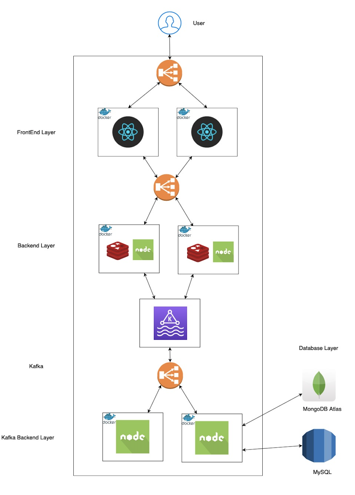

# Glassdoor Prototype

## Abstract

Glassdoor Prototype is a clone of real [Glassdoor](https://www.glassdoor.com) web application where current and former employees add reviews/photos of companies. It also allows us to create job alerts by asking interesting industry to its users. The application has three entities,
* **User:** A User can apply to different jobs at different companies with a resume and cover letter attached and check the status of the application at any time. He can update his profile by adding/updating past experience, education, and skills. Users can contribute by adding reviews/photos/interview experiences of their previous companies anonymously. 
* **Employer:** An employer is the one who posts jobs for his company. He can see an overall impression of his company through matrices like overall ratings, interview experience, CEO approval from employees, and whether the employee would recommend this company to a friend or not. 
* **Admin:** This is the administration account of **Glassdoor** and is responsible for filtering out inappropriate reviews and photos added by users. If the admin approves the review/photo then only it can be made publicly available. One of the major features for admin is the dashboard which shows no of reviews per day, top 5 users with highest approved reviews, top 10 CEOs based on ratings, etc.

The application has the following features,
* **Backend**
    * Each backend route is secured using PassportJS meaning no unauthorized user can access it
    * `Kafka` is used to improve performance under a large number of concurrent user requests
    * To reduce the time taken by each request to be served is reduced using `Redis`
    * Some of the APIs use server-side pagination to decrease Frontend rendering load
    * To store the passwords of users securely `MySQL` is used and to retrieve all other information quickly `MongoDB` is used

* **Frontend**
    * The frontend heavily uses components in `ReactJS` to increase the reusability
    * Job/Company search is shown using `Pagination` so that the user does not get overwhelmed
    * A simple and user-friendly UI is developed in `HTML` and `CSS`
    * Admin dashboard is loaded with informative graphs (Bar, Wordcloud, etc.)
    * `Modals` are used to remove excessive back and forth to do a single task

## Architecture


## Testing

#### Performance Test

To see how the application performs under thousands of concurrent requests, we used `JMeter` to test its performance. We tested the application in several conditions which are as follows,
```
Base
Base + DB Connection Pooling
Base + DB Connection Pooling + Kafka
Base + DB Connection Pooling + Kafka + Redis
Base + DB Connection Pooling + kKafka + Redis + Load balancing
```

We saw a great performance boost at each step. The last step had `25%` increased throughput and `20%` reduced time to serve requests.


## Output


## Technology Stack

#### Backend
* NodeJS
* PassportJS
* Kafka
* MongoDB
* MySQL
* Redis

#### Frontend
* ReactJS
* Bootstrap
* Recharts

#### Deployment
* AWS EC2

## Team
* [Jainish Parikh](https://github.com/jainishparikh)
* [Mihir Patel](https://github.com/mihir-1997)
* [Prachal Patel](https://github.com/Prachal80)
* [Naman Agrawal](https://github.com/agrawalnaman)

## References

* https://nodejs.org/en/
* https://reactjs.org
* https://recharts.org/en-US/
* https://nivo.rocks
* http://www.passportjs.org
* https://www.mongodb.com
* https://www.mysql.com
* https://redis.io
* https://aws.amazon.com/ec2/